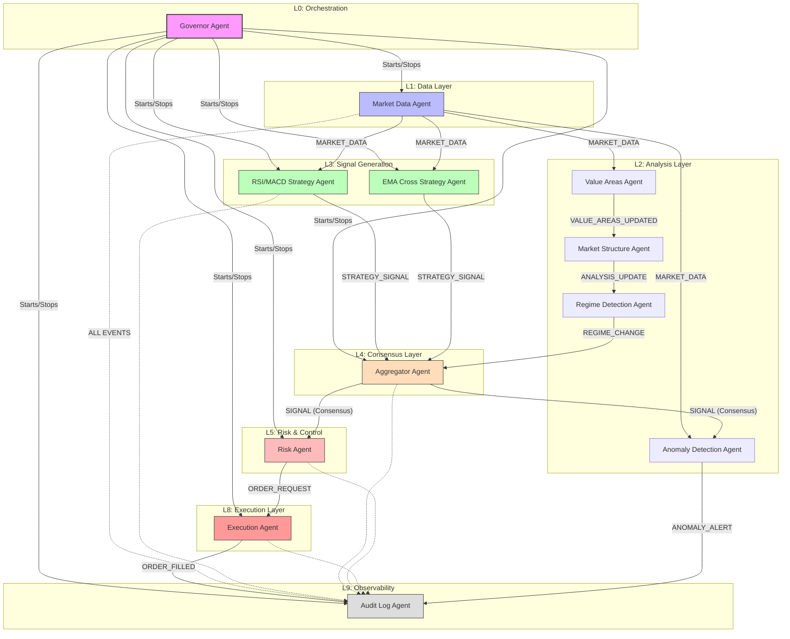

# AI Trader Agent Architecture

This document describes the multi-agent architecture and event-driven workflow of the AI Trader application.

## High-Level Workflow

The system operates as a **Hierarchical Multi-Agent System** connected via an asynchronous **Event Bus**. This design ensures loose coupling, fault tolerance, and specialized reasoning for different trading tasks.

### Mermaid Flowchart

## Agent Responsibilities

| Agent | Responsibility | Key Inputs | Key Outputs |
| :--- | :--- | :--- | :--- |
| [**Governor**](./agents/governor_agent.md) | Orchestrates the system lifecycle and manages agent state. | System Config | Start/Stop Commands |
| [**Market Data**](./agents/market_data_agent.md) | Fetches real-time OHLCV data from BingX and persists it. | Exchange API | `MARKET_DATA` |
| [**Value Areas**](./agents/value_areas_agent.md) | Calculates VPVR, POC and Value Area levels per timeframe. | `MARKET_DATA` | `VALUE_AREAS_UPDATED` |
| [**Market Structure**](./agents/market_structure_agent.md) | Analyzes POC trends and EMA alignments. | `VALUE_AREAS_UPDATED` | `ANALYSIS_UPDATE` |
| [**Regime Detection**](./agents/regime_detection_agent.md)| Classifies the market (Trending vs Ranging) to adjust strategy weights. | `ANALYSIS_UPDATE` | `REGIME_CHANGE` |
| [**Aggregator**](./agents/aggregator_agent.md) | Buffers signals and finds consensus using regime-adaptive weighting. | `STRATEGY_SIGNAL` | `SIGNAL` (Consensus) |
| [**Risk Agent**](./agents/risk_agent.md) | Validates account balance, calculates position sizing, and enforces limits. | `SIGNAL` | `ORDER_REQUEST` |
| [**Execution**](./agents/execution_agent.md) | Handles the low-level API interaction to place orders on the exchange. | `ORDER_REQUEST` | `ORDER_FILLED` |
| [**Anomaly Detection**](./agents/anomaly_detection_agent.md)| Monitors for flash crashes or excessive system signal frequency. | `MARKET_DATA`, `SIGNAL`| `ANOMALY_ALERT` |
| [**Audit Log**](./agents/audit_log_agent.md) | Listens to all bus traffic and creates a permanent record in the database. | All Event Types | Database Records |

## Implementation Details

- **Event Bus**: An asynchronous pub-sub mechanism (`app/core/event_bus.py`) that decouples agents.
- **Base Agent**: All agents inherit from `BaseAgent`, providing a standardized `run_loop`, lifecycle management, and a unified logging interface (`self.log`, `self.log_llm_call`, `self.log_market_action`).
- **Regime-Adaptive Weighting**: The Aggregator increases EMA weights in `TRENDING` markets and RSI weights in `RANGING` markets.
- **Safety**: The Risk Agent acts as a final gateway, ensuring no trade is placed without sufficient liquidity and confidence.

# Tasks

You will now add each of the strategy agents to the system. Currently there are 3 strategy agents:

1. RSI based strategy agent
2. MACD based strategy agent
3. Dummy Agent

- [ ] Allow strategy agents to be activated/deactivated from the UI, allowing the user to select which strategy agents are running and which are not.
- [ ] Remove strategy agents 1 and 2 from the sysyem. Only the Dummy Agent is desired out of the 3.
- [ ] Add new strategy agents to the system. There will be one agent for each of the following strategies:
    - EMA Strategy Agent
    - Cycles Strategy Agent
- [ ] Any questions you have in order to implement all these features properly, please ask me by adding them to the TODO.md file and asking me to answer them.

## General Agent Information

- [ ] In the docs/text/ folder there are plenty of text files corresponding to transcripts of a trading course that teaches how to trade properly. The system is intended to replicate the trading course as closely as possible.
- [ ] There is also information (possible duplicated) in docs/topics/ folder. Add this information to the system as well, both in documentation and implementation, as well as any prompts that benefit from the information.
- [ ] There is more information on each of the strategies in the docs/strategies/ folder. This folder contains code for another website where the strategies where semi-implemented, and they contain notes on how to implement them.

Any questions don't hesitate to ask me.

Therefore:
- [ ] go through all this content (there are plenty of text files) and read them carefully. Any valuable information you find should be applied to the system by adding it to the prompts, adding it to the corresponding Agent's documentation and implementation.
- [ ] Add Agents to continue to populate the analysis object with analysis information for each coin. Do so based on the trading course notes, documentation files and what is described in this document, as well as referencing the analysis JSON schema.

## Agents

I would like to implement the following agents to be able to handle different tasks. I have given as much information as I can on each one. Figure out what is required for each Agent based on documentation. Apply all the information to the system and use LLMs anywhere where it is required or will work best.

1. Cycles Strategy Agent
2. EMA Strategy Agent
3. Value Areas Agent
4. Regime Change Agent
5. Market Structure Agent
6. Support and Resistance Agent
7. Anchored VWAP Agent
8. Fibonacci Retracement Agent
9. Execution Agent
10. SFP Strategy Agent

Improve documentation for all these agents to reflect what is implemented and what is mentioned in the trading notes.

Modify the analysis object if required to store more or better information.

Note that agents must perform their initial analysis and then continue to update the analysis object as new data comes in.
Also, wherever possible, analysis entries should be stored in the analysis object for agents to use in their analysis and store their conclusions for other agents to use. The JSON schema already defines many of these entries and where they are located.

#### EMA Strategy Agent

- [ ] Look at EMAs for crossovers of the 9, 25 and 55 perios EMAs (specific EMA periods might differ slightly, use whichever are available in the market data)
- [ ] Look at EMAs fanning out, indicating the beginning of a strong move.
- [ ] Look at market structure, as well as market regime (bullish or bearish) to determine if the coin is in a strong move or beginning of a strong move.
- [ ] Populate the analysis object ema_strategy.analysis field with an entry containing a final conclusion analysis on the coin based on the above criteria.
- [ ] Apply max prompt engineering to the strategy agent to perform this analysis.
- [ ] If the analysis is giving a buy or sell signal, add a trade setup entry to the analysis object with all the required parameters. Ensure the trade setup is valid and makes sense.

#### Cycles Strategy Agent

- [ ] Look at market structure, as well as market regime (bullish or bearish) to determine if the coin is in a strong move or beginning of a strong move.
- [ ] Populate the analysis object cycles_strategy.analysis field with an entry containing a final conclusion analysis on the coin based on the above criteria.
- [ ] Apply max prompt engineering to the strategy agent to perform this analysis.
- [ ] If the analysis is giving a buy or sell signal, add a trade setup entry to the analysis object with all the required parameters. Ensure the trade setup is valid and makes sense.

Here is more information on the cycles strategy:
- Compare Heikin Ashi candles and phases with Relative Candles Phases to determine Cycles.
- Check for trending cycles.
- Check if the entry trigger activated.
- Define direction: UP/DOWN/NEUTRAL
- Observe higher timeframe alignmet for context and confidence
- Check alignment with any levels.
- Choose if SL should be usual or below/above a certain level nearby
- Don't choose safer SL if it's more than 1x ATR away and timeframe is larger than 30m. If larger or equal to 30minute timeframe use less safe SL.
- Write an entry for the cycles_strategy field in the analysis object.

#### Value Areas Agent

- check VPVR for potential ideas as to where there are value areas.
- Compute multiple window linear regressions to determine value areas. local ranges form where lineara regression slopes are close to 0, and window sizes help indicate the size of the value area. It is not an exact science but use this to determine possible value areas.
- For each value area, check whether it makes sense as a local range.
- Use all the value area ideas to determine what the final best value areas are that make sense to use.
- define start_date and end_date for each value area.
- Compute value area values: vah, val, poc, resistance (range high), support (range low), etc. Note that range high and range low are defined by the wicks of the candles, not the bodies of the candles. This is different to the rest of support and resistance levels in the system.
- Consider global and local ranges. Value areas might overlap, making some value areas contained or part of a much larger value area. Select the best most sensible value areas.
- check key levels for value area related prices for ideas of localised ranges. Maybe the value area prices align with the key levels.
- The larger the value area, the stronger the support and resistance levels are, as well as POC and naked POCs. Somehow take this into consideration wherever relevant in analysis.
- Determine start and finish candles. The start and finish candles should be the first and last after/before the candle that moved price INTO the value area, meaning the candle that is partly inside the value area and partly out should NOT be included.
- Find current value area or one in the past it is re-entering.
- Find last value area it left. There is likely to be a naked POC here.
- Determine naked POCs.

#### SFP Strategy Agent

- Find next level above where an SFP would be great to short from.
- Find next level below where an SFP would be great to long from.
- Look for levels with high confluence to find highest probability trade setups.
- Add trade setup to analysis object if a good SFP trade setup is found.
- Write why this is a good level for SFP setup.
- Check for naked POCs. These always have a high probability of being a good SFP level.
- Check higher timeframe support and resistance levels for ideas of where SFP levels might be, look for confluence.
- Check current value area high and low, and current range high and low for ideas of where SFP levels might be, look for confluence.
- Check POCs for ideas of where SFP levels might be, look for confluence.

#### Market Structure Agent

- Apart from what is already mentioned, also check Weis Waves volume (for each candlestick type) to determine market structure. Add this to the JSON schema somewhere. Volume increasing on the buy phases and decreasing on the sell phases is bullish, and vice versa. Figure out the best way to implement this based on notes and trading course.
- Observers highs and lows, heikin ashi, relative candle phases, observations on volume, obv divergences on 15m timeframe, cycles, value areas moving up or down, adx strength and directionality indicators to understand market structure. 
- Provides solid analysis on market structure and adds it to the analysis object.
- Choose wisely what should be done by the Market Structure Agent and what should be done by the Market Regime Agent.

#### Support and Resistance Agent

- SUPER IMPORTANT: Levels are defined by the body of the candles, not the wicks.
- Check closest support and closest resistance indicators in market data for ideas. These are not calculated in the best way but can give ideas when used in confluence with other information.
- Read the different williams fractals for ideas of where support and resistance levels might be.
- Assert levels are on the body of the candle and not the wick when adding them to the analysis object.
- Check the edges of value areas, these are likely to have good support and resistance levels.
- Check well-respected Pivot Points for ideas of where support and resistance levels might be.
- Check naked POCs and POCs for ideas of where support and resistance levels might be. Again, confluence will be key to determining which are the best levels
- Check all notes for more information on support and resistance levels.
- Consider alignment with anchored VWAPs for high probability levels.
- 

#### Anchored VWAP Agent

- Find beginning of last major move.
- Calculate anchored VWAP from the beginning of the last major move.
- Use Gaussian Processes to project the anchored VWAP into the future.
- Store anchored VWAPS in the analysis object, in their own field.
- Store the projection into the future
- Write the last_updated field for the anchored VWAPs in order to clearly know what information is historical and what information is a projection.
- Define a sensible prior for the anchored VWAPs Gaussian Process. Consider studying the notes or real examples to define a good prior.
- Anchored VWAP is only added if it is considered to be relevant. If the anchored VWAP idea isn't good enough, ignore it completely.
- Determines whether the anchoored VWAP is being respected, and if it is valid as a dynamic support or resistance level.

#### Fibonacci Retracement

- Observe anchored VWAPS dates to find first point in fibonacci retracement pull (first point matches with the start of an anchored VWAP).
- Define whether to pull up or down based on this information.
- Find max/min of the move to find second point in fibonacci retracement pull.
- Calculate only the 66.6% and 70.6% retracement levels. All other levels are completely ignored.
- These 2 fib levels for what is known as the CC channel, and together they define a strong area to consider for pullbacks.
- Analysis: Do these fib levels align with any other major support or resistance levels? Do they align with any key levels? Do they align with any value area POCs? Do they align with any VWAPs?

#### 20Bounce Strategy Agent

- Defined in docs/strategies/Bounce.md, add as another strategy similar to EMA Strategy.
- Create an Agent around this strategy that works on similar concepts to the EMA Strategy Agent.

#### Don't know which is best Agent

- I don't know whether it is best to add this to an existing agent or make it an Agent of its own.
- Check OBV for divergences with price on the 15m timeframe only.
- Look at overall direction of highs and lows. Not very specific candles but an overall view, considering as many candles as there could be in a single EMA move where EMAs are in a certain order (I'm saying this as reference to make myself understood better).
- Note down any divergences found. Use documentation notes to understand how to implement this better.

#### Analyst Agent

- Understands how to use all information in analysis object to reach conclusions and high-probability trade setups of the highest quality.
- Understands what tools are availablem and when to use each one.
- Looks for confluence.
- Explores multiple timeframes and tools to find high-probability setups with high confluence.
- Performs a top-down multi-timeframe approach to analysis.
- It starts on the higher timeframes and works its way down.

#### Trader Agent (maybe this role belongs to Analyst, Aggregator, Risk or Execution Agent)

- Executes trade idea form Analyst Agent.
- Receives analysis object from Analyst Agent with trade proposals.
- Tracks relevant information for each trade and waits for the right moment to take action.
- Monitors all relevant information to determine whether the trade setup is playing out as expected. For example the trade setup might anticipate a bounce of a key level which does not end up happening, thus invalidating the trade idea.
- Cancels trade setups that are no longer valid.
- Assesses amount of confluence and confidence in a trade.
- Stores list of waiting times for coins and strategies to know when to check price next. Maybe a certain strategy requires at least a certain amount of candles before it is worth checking again, meaning it should wait for more candles to be added.

#### Volume Agent

This agent might not be necessary since its tasks might be better handled by other agents that already exist.

- Understands volume tools available: OBV, Weis Waves Volume, Relative Candles Weis Waves Volume, Heikin Ashi Weis Waves Volume, Session Volume, Fixed Ranege VOlume Profiles (Value areas), VPVR, POCs, VALs, VAHs.
- Analyses each tool individually and collectively on multiple timeframes. Then performs an overall analysis and conclusion on the information gathered.
- Defines volume patterns and conclusions, key levels such as naked POCs, current trend strength, and previous value areas of interest.

#### Risk Agent

Compares trade proposals, current state of portfolio (overall risk, margin available, directional bias, portfolio composition), confidence/confluence metrics on trade setups, and anomaly detection information to determine:

- whether to take the trade proposed
- how much risk to put into the trade (within certain constraints)
- Ensure good SL and TP prices (valid and reasonable).
- Ensures trade setups have at least a 1:1 risk-reward-ration, Anything lower will be ignored. The higher the risk-reward ratio, the better.
- outputs clear trade signals ready to be directly executed

#### Execution Agent

- Places trades, noquestions asked.
- In charge of execution, not analysis.
- Sets/checks leverage before placing orders.
- Places SL and TP orders.
- Confirms all orders have been placed.
- For demo, SL and TP orders are handled by the demo agent.

Note that it may be required to implement a live_engine apart from the demo_engine to handle live trading on BingX exchange.

### Strategy Agent Details

- There is one agent created for each strategy.
- Trader Agent keep a tab on what strategies to apply when and on what coins. OR maybe there is another agent that handles this.
- Have clearly defined rules for a trade setup
- Process all necessary indicators.
- Can use information from analysis object and from other agents (through this object).
- Output trade setups/ideas. These are also stored in the analysis object.
- Can tell other Agents how long to wait if a certain amount of waiting is required before checking again.

After fully analysing a symbol, trades should be executed or waiting times for in place before checking again. Waiting times should be conservative enough to not mistakenly make the system miss opportunities. It is better to overcheck than to miss opportunities. Once waiting times are in place, market data agent doesn't need to be continuously checking for new candles, and can maybe move on to another symbol if the system is idle.

- [ ] The initial limit of 10 symbols can be increased to 30 symbols.

## Analysis Object

Store any information you consider relevant in the analysis object. Add it to the JSON schem and edit it however you see fit, only if it is beneficial to the trading process and aligns better with the trading course concepts and ideas.

