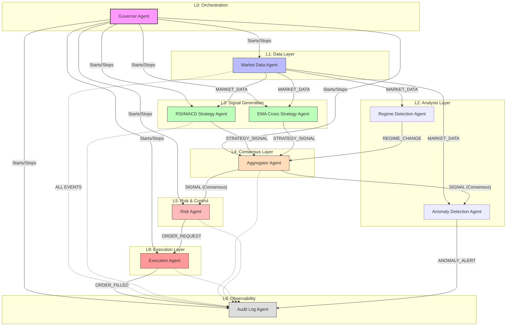

# AI Trader Agent Architecture

This document describes the multi-agent architecture and event-driven workflow of the AI Trader application.

## High-Level Workflow

The system operates as a **Hierarchical Multi-Agent System** connected via an asynchronous **Event Bus**. This design ensures loose coupling, fault tolerance, and specialized reasoning for different trading tasks.

### Mermaid Flowchart

## Agent Responsibilities

| Agent | Responsibility | Key Inputs | Key Outputs |
| :--- | :--- | :--- | :--- |
| [**Governor**](./agents/governor_agent.md) | Orchestrates the system lifecycle and manages agent state. | System Config | Start/Stop Commands |
| [**Market Data**](./agents/market_data_agent.md) | Fetches real-time OHLCV data from BingX and persists it. | Exchange API | `MARKET_DATA` |
| [**Strategy Agents**](./agents/strategy_agents.md) | Apply technical indicators (RSI, MACD, EMA) to generate trade ideas. | `MARKET_DATA` | `STRATEGY_SIGNAL` |
| [**Regime Detection**](./agents/regime_detection_agent.md)| Classifies the market (Trending vs Ranging) to adjust strategy weights. | `MARKET_DATA` | `REGIME_CHANGE` |
| [**Aggregator**](./agents/aggregator_agent.md) | Buffers signals and finds consensus using regime-adaptive weighting. | `STRATEGY_SIGNAL` | `SIGNAL` (Consensus) |
| [**Risk Agent**](./agents/risk_agent.md) | Validates account balance, calculates position sizing, and enforces limits. | `SIGNAL` | `ORDER_REQUEST` |
| [**Execution**](./agents/execution_agent.md) | Handles the low-level API interaction to place orders on the exchange. | `ORDER_REQUEST` | `ORDER_FILLED` |
| [**Anomaly Detection**](./agents/anomaly_detection_agent.md)| Monitors for flash crashes or excessive system signal frequency. | `MARKET_DATA`, `SIGNAL`| `ANOMALY_ALERT` |
| [**Audit Log**](./agents/audit_log_agent.md) | Listens to all bus traffic and creates a permanent record in the database. | All Event Types | Database Records |

## Implementation Details

- **Event Bus**: An asynchronous pub-sub mechanism (`app/core/event_bus.py`) that decouples agents.
- **Base Agent**: All agents inherit from `BaseAgent`, providing a standardized `run_loop` and lifecycle management.
- **Regime-Adaptive Weighting**: The Aggregator increases EMA weights in `TRENDING` markets and RSI weights in `RANGING` markets.
- **Safety**: The Risk Agent acts as a final gateway, ensuring no trade is placed without sufficient liquidity and confidence.
